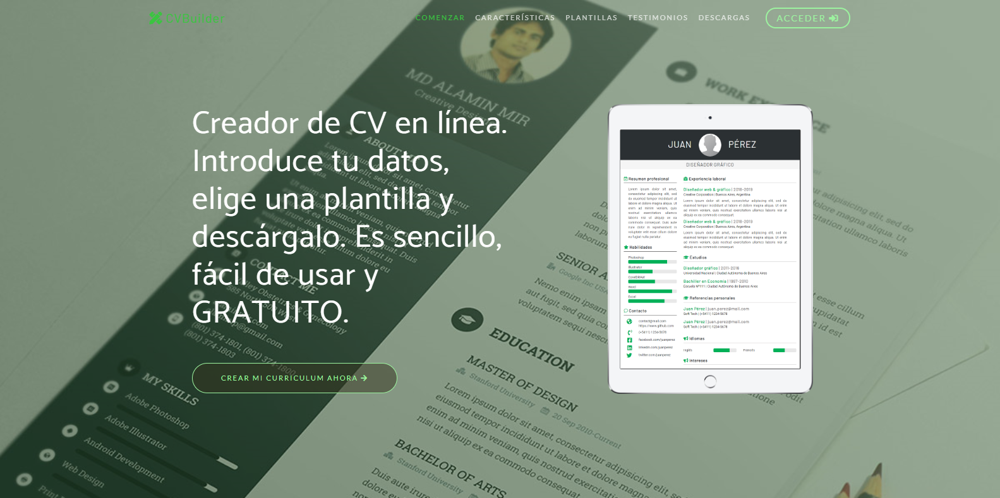
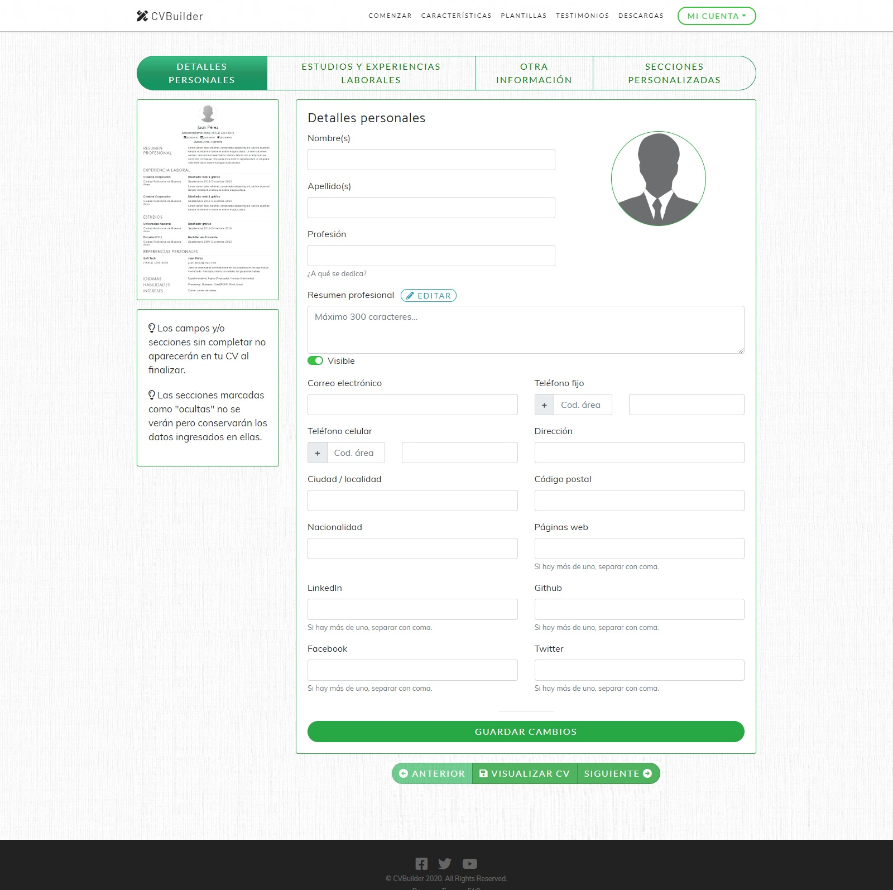
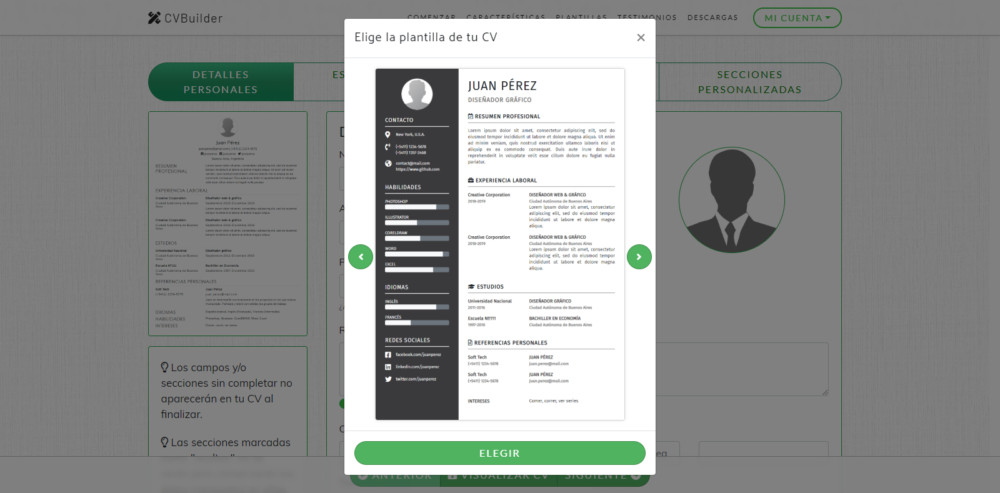
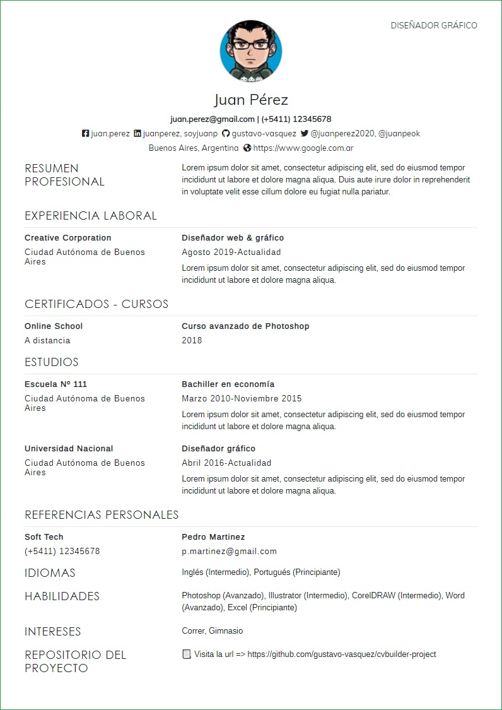
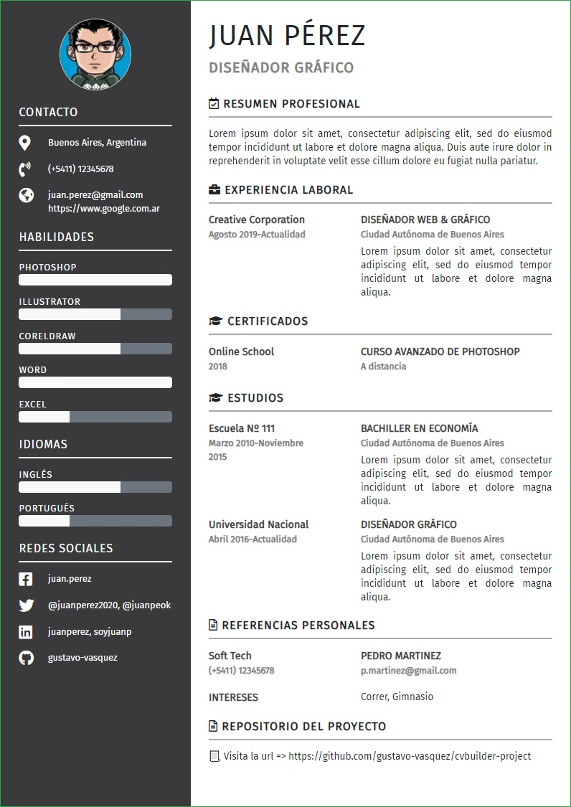
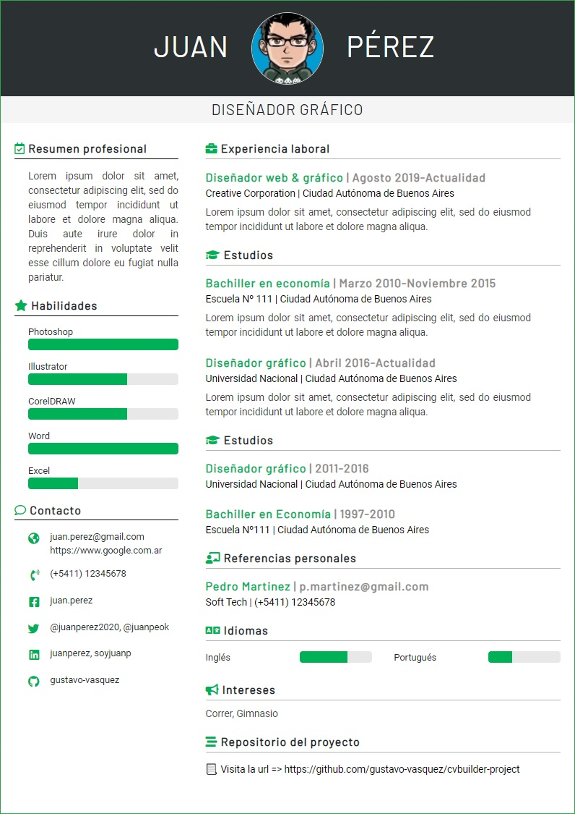

# CVBuilder
Asistente detallado para la creación de curriculum en línea de forma rápida y eficaz.

## Funcionalidades
<ul>
  <li>Creación de usuarios</li>
  <li>Autenticación con servicios externos (Microsoft, Google, Github, LinkedIn)</li>
  <li>Completar secciones del curriculum de forma modular</li>
  <li>Posibilidad de crear secciones personalizadas</li>
  <li>Tres plantillas seleccionables de curriculum</li>
  <li>Generación de PDF</li>
  <li>Imprimir curriculum</li>
</ul>

## Tecnologías/librerías/plugins
<ul>
  <li>HTML5</li>
  <li>CSS</li>
  <li>Bootstrap</li>
  <li>Javascript</li>
  <li>Jquery</li>
  <li>Ajax</li>
  <li>ASP.NET MVC C#</li>
  <li>Entity framework</li>
  <li>SQL Server</li>
  <li>ASP.NET Identity</li>
  <li>OWIN</li>
  <li>Automapper</li>
  <li>Font Awesome</li>
  <li>Jquery Easing</li>
  <li>dom-to-image</li>
  <li>jsPDF</li>
</ul>

PORTADA
:-------------------------:

LOGIN Y REGISTRO
:-------------------------:

PESTAÑAS CON LAS SECCIONES DEL CURRICULUM
:-------------------------:

CAMBIO DE PLANTILLA
:-------------------------:

IMPRIME O DESCARGA COMO PDF
:-------------------------:

| ** PLANTILLAS DISPONIBLES ** |
:---------------------------------:

| Classic   |      Elegant      | Modern |
|----------|:-------------:|-------|
|  |   |  |

## Notas
El script de generación de la base de datos se encuentra en la carpeta "Sql_script" dentro del proyecto.

## Autor
Gustavo Vasquez
